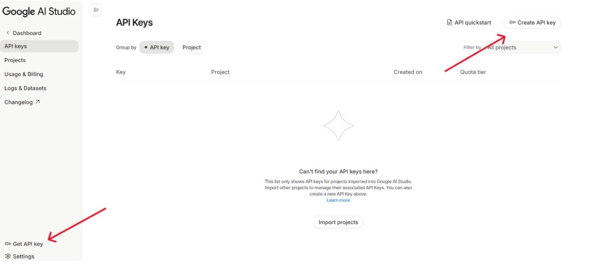
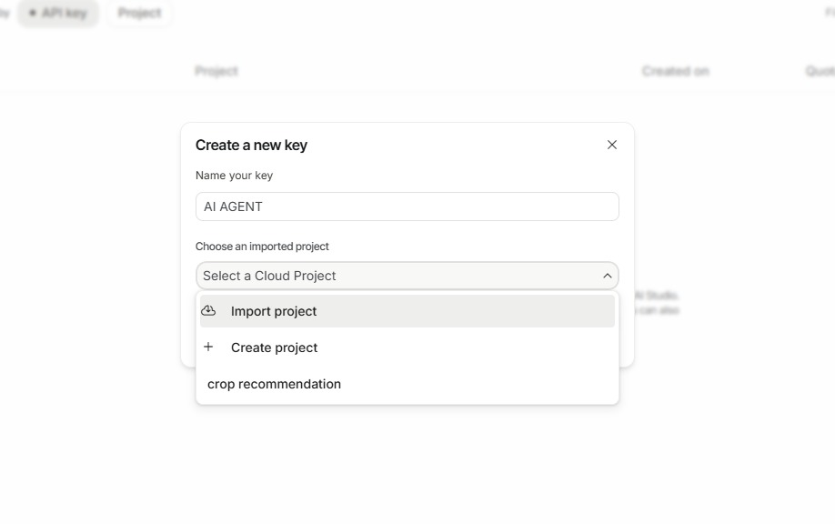
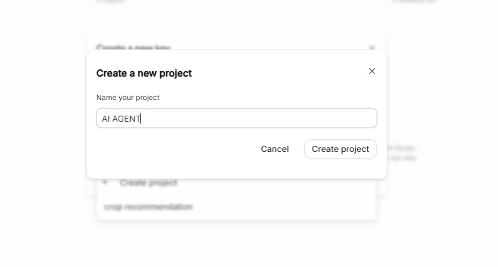
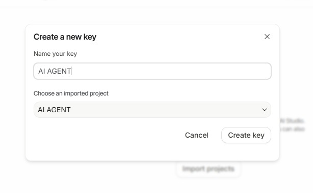

# Getting Your Gemini API Key

Let's get your free API key to power the AI magic!

## What is an API Key?

An API key is like a password that lets your code access Gemini AI. It's:
- **Free** - Google provides generous free tier
- **Personal** - Each person gets their own
- **Secure** - Keep it secret, never share publicly

---

## Step-by-Step Guide

### Step 1: Visit Google AI Studio

Open your browser and go to:

**🔗 [https://aistudio.google.com/](https://aistudio.google.com/)**



---

### Step 2: Sign In

Sign in with your Google account (Gmail).

---

### Step 3: Click "Get API Key"

Look for the **"Get API key"** button in the top navigation.



---

### Step 4: Create API Key

You'll see a dialog with options:

1. Click **"Create API key in new project"** (if first time)
   - OR select an existing project



---

### Step 5: Copy Your Key

Your API key will be displayed. Click the **copy icon** to copy it.



**⚠️ Important:** Keep this key safe! Don't share it publicly or commit it to GitHub.

---

## Setting Up Your API Key

### Step 1: Create `.env` File

In your project folder (`ai-agent-whatsapp`), create a file named exactly:

```
.env
```

**Note:** The file starts with a dot (`.env`) - no other name!

---

### Step 2: Add Your Key

Open `.env` in a text editor and add:

```env
GEMINI_API_KEY=your_api_key_here
```

**Replace** `your_api_key_here` with the key you copied.

**Example:**
```env
GEMINI_API_KEY="AIzaSyABcDEfGh1234567890abcdefghIJKLMN"
```

---

### Step 3: Save the File

Save and close the `.env` file.

**✅ Done!** Your API key is now configured.

---

## Verify It's Working

Your `.env` file should look like this:

```env
GEMINI_API_KEY="AIzaSyABcDEfGh1234567890abcdefghIJKLMN"
```

**File Location:**
```
ai-agent-whatsapp/
├── .env              ← Your API key here
├── main.py
├── gemini_parser.py
└── whatsapp_automation.py
```

---

## Security Best Practices

### ✅ DO:
- Keep `.env` file in your project root
- Add `.env` to `.gitignore` (already done in our repo)
- Keep your API key private

### ❌ DON'T:
- Share your API key publicly
- Commit `.env` to GitHub
- Email or message your key to others
- Post screenshots showing your key

---

## Troubleshooting

### "API key not found" error?

**Check:**
1. File is named exactly `.env` (with the dot)
2. File is in project root folder (same level as `main.py`)
3. No extra spaces in the file
4. Key is pasted correctly (no quotes needed)

### "Invalid API key" error?

**Check:**
1. Copied the entire key (they're usually long)
2. No extra spaces before or after the key
3. Key is active in Google AI Studio

### Need to regenerate key?

Go back to [Google AI Studio](https://aistudio.google.com/) → API Keys → Create new key

---

## Usage Limits

**Free Tier:**
- ✅ 60 requests per minute
- ✅ 1,500 requests per day
- ✅ More than enough for our project!

**Upgrade?** Only needed if building commercial apps.

---

## Example `.env` File

Here's what your complete `.env` file should look like:

```env
# Google Gemini API Configuration
GEMINI_API_KEY="AIzaSyABcDEfGh1234567890abcdefghIJKLMN"
```

---

## Next Steps

API key configured? Let's clone the code!

[Clone Repository →](clone-repo.md){ .md-button .md-button--primary }

---

## Quick Reference

| Item | Details |
|------|---------|
| **Website** | [aistudio.google.com](https://aistudio.google.com/) |
| **File name** | `.env` |
| **Format** | `GEMINI_API_KEY=your_key_here` |
| **Location** | Project root folder |
| **Free limit** | 60 req/min, 1500 req/day |

---

**Remember:** Your `.env` file is already in `.gitignore`, so it won't be accidentally committed to GitHub! 🔒
