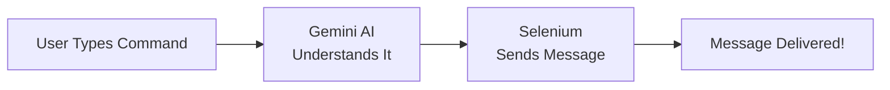
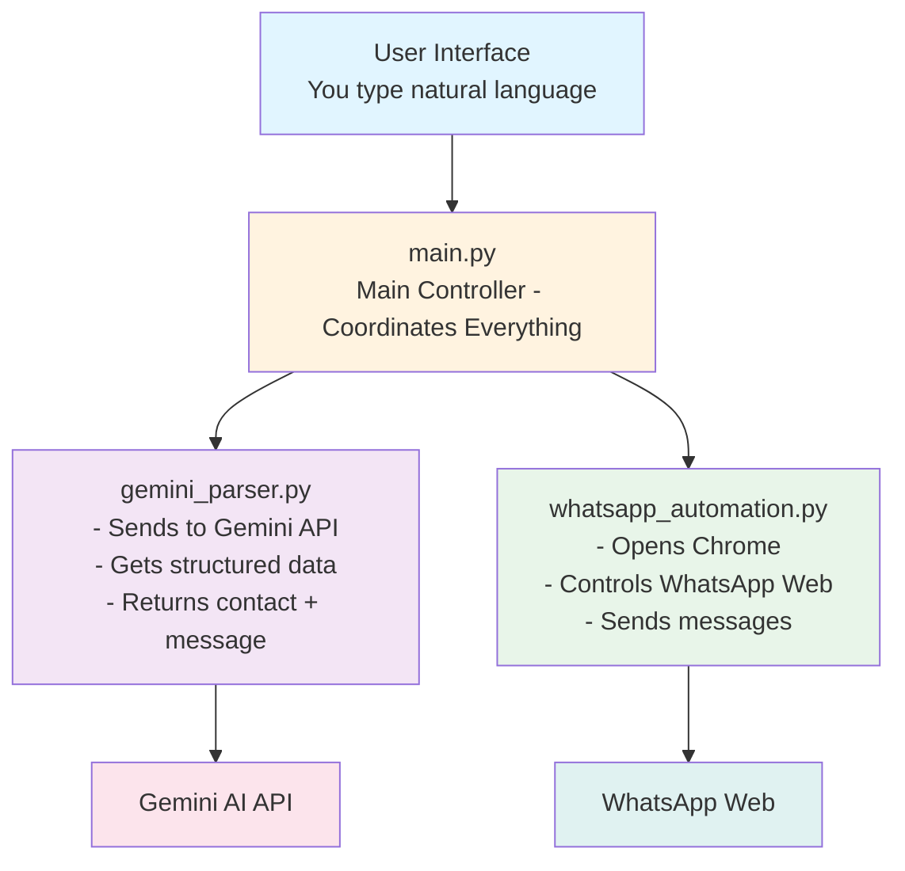

# How It Works - Theory Overview

Understanding the system before we code.

## 1. The Big Picture

Our WhatsApp AI Agent works in 4 simple steps:



---

## 2. Step 1: Natural Language Input

**You type in plain English:**
- "send message to John saying hello"
- "tell Mom I'll be home by 7"
- "message Sarah that meeting is cancelled"

The agent accepts any natural way you'd phrase a messaging command.

---

## 3. Step 2: AI Processing (Gemini API)

**What happens:**

1. Your command is sent to Google's Gemini API
2. Gemini extracts two key pieces of information:
   - **Contact name** (who to message)
   - **Message content** (what to say)

**Example:**

```
Input: "send message to Mom saying I'll be late"

Gemini extracts:
{
  "contact": "Mom",
  "message": "I'll be late"
}
```

---

## 4. Step 3: Browser Automation (Selenium)

**What happens:**

1. Selenium opens Chrome browser
2. Navigates to WhatsApp Web
3. Searches for the contact name
4. Types the message
5. Presses Enter to send

**All automatically - no human clicking required!**

---

## 5. Architecture Diagram



---

## 6. The Three Files

Our project is organized into three Python files:

### 6.1 `main.py` - The Brain 🧠
**Purpose:** Coordinates everything

- Starts the application
- Gets user input
- Calls the parser
- Calls the automation
- Shows results

**Think of it as:** The project manager who delegates tasks

---

### 6.2 `gemini_parser.py` - The Translator 🗣️
**Purpose:** Understands natural language

- Takes your command
- Sends it to Gemini API
- Extracts contact and message
- Returns structured data

**Think of it as:** The interpreter who translates English to computer instructions

---

### 6.3 `whatsapp_automation.py` - The Robot 🤖
**Purpose:** Controls the browser

- Opens Chrome
- Navigates WhatsApp Web
- Finds contacts
- Types and sends messages

**Think of it as:** The robot that does the actual clicking and typing

---

## 7. Data Flow Example

Let's trace what happens when you type a command:

**Your Input:**
```
"send message to John saying meeting at 3pm"
```

**Step 1 - User Input (main.py):**
```python
user_command = input("You: ")
# user_command = "send message to John saying meeting at 3pm"
```

**Step 2 - AI Parsing (gemini_parser.py):**
```python
parsed = parse_command(user_command)
# parsed = {"contact": "John", "message": "meeting at 3pm"}
```

**Step 3 - Confirmation (main.py):**
```
→ Contact: John
→ Message: meeting at 3pm

Send this message? (y/n): y
```

**Step 4 - Automation (whatsapp_automation.py):**
```python
success = wa.send_message("John", "meeting at 3pm")
# Opens browser, finds John, types message, sends
```

**Result:**
```
✓ Message sent successfully!
```

---

## 8. Key Concepts

### API (Application Programming Interface)
A way for different software to talk to each other. We use Gemini's API to access its AI capabilities.

### Browser Automation
Using code to control a web browser (like a human would) - clicking, typing, scrolling.

### Natural Language Processing (NLP)
Teaching computers to understand and process human language.

### Session Persistence
Saving your WhatsApp login so you don't need to scan the QR code every time.

---

## 9. Why This Approach?

**Alternative: WhatsApp Business API**
- ❌ Requires business verification
- ❌ Not free for most uses
- ❌ Complex setup

**Our Approach: Browser Automation**
- ✅ Free and simple
- ✅ Works with any WhatsApp account
- ✅ No verification needed
- ✅ Perfect for learning

---

## 10. Security & Privacy

**What's Safe:**
- Your API key is stored locally in `.env` file
- Chrome session saved locally in `chrome_profile/` folder
- Everything runs on your computer

**Important:**
- Never share your API key
- Don't commit `.env` to GitHub
- Use responsibly - no spam!

---

Now that you understand how it works, let's get your API key!

[Get API Key →](api-key.md){ .md-button .md-button--primary }
